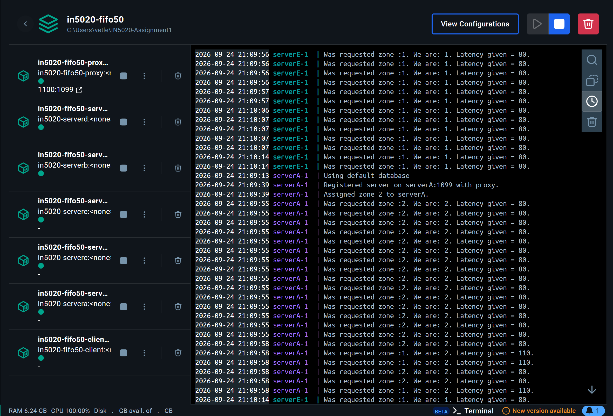

# IN5020 Group 2

## How to run

### Requirements
* Java Development Kit V.21
* Docker Engine
* Docker Compose V2

### Installing and running

If on Windows, run:
```bash
./runwin.ps1
```

If on Linux, run:
```bash
./run.sh
```

If on Mac, run (untested due to no macs in group):
```bash
./runmac.sh
```

## Workload distribution

* Eirik
  * Client, query-parsing and tester
  * Processing Server, logic and number crunching
* Oscar
  * Proxy / load balancer
  * Servers registration
  * Clients request to Proxy
* Vetle
  * Dockerization
  * Docker Compose
* Kine
  * Caching

## Run time images
